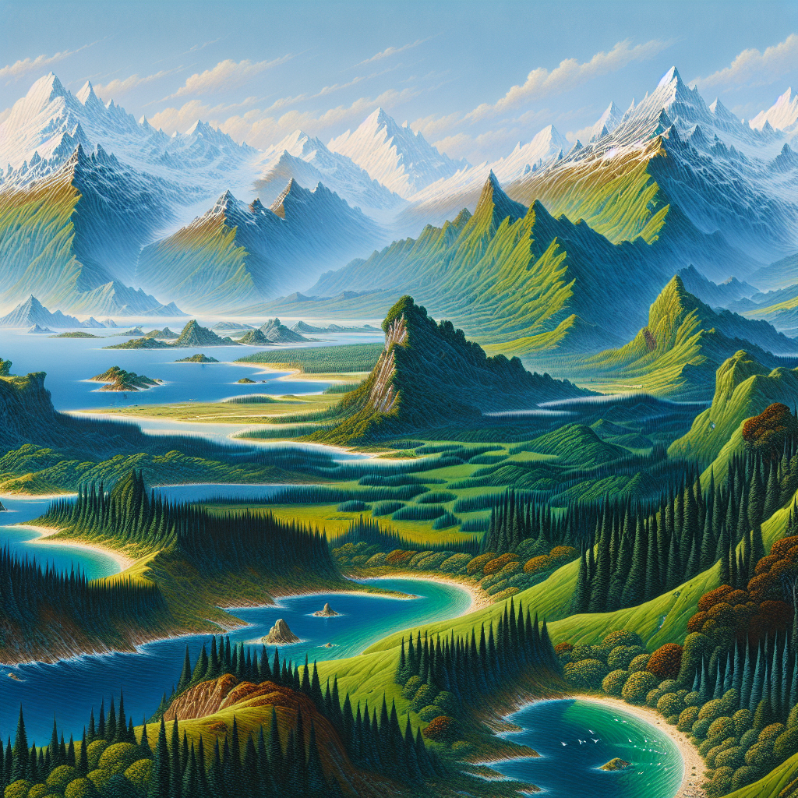

# Aesheron

## Overview

Aesheron, often referred to as the Land of Echoes, is a realm of high fantasy and boundless intrigue. Home to a diverse array of peoples, cultures, and fantastical races, Aesheron's landscapes are as varied as its inhabitants. From the majestic [Kingdoms](Kingdoms.md) that dot its expanse to the mystical and often uncharted territories, Aesheron is a land that invites adventure and exploration.

## Geography

The geography of Aesheron is marked by contrasts. In the north, the [Frostspire Mountains](Frostspire%20Mountains.md) tower over the land, their peaks perpetually snow-capped. To the west, the [Verdant Woods](Verdant%20Woods.md) provide a lush, green canopy that is home to the [Elves](Elf.md) and other woodland creatures. The central region is dominated by the [Plains of Valor](Plains%20of%20Valor.md), a vast expanse of grasslands where nomadic tribes roam. The eastern shores are lapped by the [Crystal Sea](Crystal%20Sea.md), famous for its clear blue waters and the mysterious [Isles of Whisper](Isles%20of%20Whisper.md).

## Notable Locations

- **[Stormhold Castle](Stormhold%20Castle.md)**: A fortress of ancient design, standing guard over the [Silverlake Valley](Silverlake%20Valley.md).
- **[The Shrouded City](The%20Shrouded%20City.md)**: A city enshrouded in perpetual mist, known for its arcane academies and mystical archives.
- **[Ruins of Eldara](Ruins%20of%20Eldara.md)**: Once a grand city of the [Ancients](Ancients.md), now a ruin teeming with secrets and hidden treasures.
- **[Caverns of Echo](Caverns%20of%20Echo.md)**: A network of underground caves known for their strange acoustic properties, where one's whispers can be heard miles away.

## History

Aesheron's history is rich and storied, filled with epic tales of heroism, magic, and the struggle between light and darkness. The [Ancient War](Ancient%20War.md) marks a significant period in Aesheron's past, where legendary figures like the wizard [Morath](Morath.md) and the warrior queen [Alyndra](Alyndra.md) played pivotal roles. Historical sites such as the [Fallen Temple of the Moon](Fallen%20Temple%20of%20the%20Moon.md) and the [Battlefield of Forgotten Kings](Battlefield%20of%20Forgotten%20Kings.md) serve as reminders of these bygone eras.

## Culture and Society

The inhabitants of Aesheron range from the [Humans](Human.md) in their bustling cities to the reclusive [Dwarves](Dwarf.md) in their mountain fortresses. The [Elves](Elf.md) of the Verdant Woods live in harmony with nature, while the [Nomads of the Eastern Sands](Nomads%20of%20the%20Eastern%20Sands.md) follow ancient traditions unknown to the outside world. Each culture has its unique customs, beliefs, and ways of life, contributing to Aesheron's rich tapestry.

## Magic and Lore

Magic is an integral part of Aesheron, woven into the very fabric of the land. The [Mages of the Crystal Tower](Mages%20of%20the%20Crystal%20Tower.md) are renowned for their spellcraft, while the secretive [Order of the Veiled Eye](Order%20of%20the%20Veiled%20Eye.md) guards ancient magical knowledge. Places like the [Enchanted Grove](Enchanted%20Grove.md) and the [Well of Stars](Well%20of%20Stars.md) are imbued with magical energies, attracting adventurers and scholars alike.

## Economy and Trade

Aesheron's economy is as diverse as its people. The [Dwarven Mines](Dwarven%20Mines.md) produce precious metals and gems, while the [Fields of Golden Grain](Fields%20of%20Golden%20Grain.md) in the central regions are known for their bountiful harvests. Trade routes such as the [Silk Road](Silk%20Road.md) and the [Sea Merchant's Path](Sea%20Merchant'S%20Path.md) connect distant lands, facilitating the exchange of goods, ideas, and cultures.

## Governance and Power

Aesheron is governed by various forms of rule, from the [Monarchies of the Northern Realms](Monarchies%20of%20the%20Northern%20Realms.md) to the [Councils of the Free Cities](Councils%20of%20the%20Free%20Cities.md). Power dynamics often shift, with alliances and rivalries shaping the political landscape. The [Order of the Crimson Blade](Order%20of%20the%20Crimson%20Blade.md) serves as a neutral force, maintaining balance and order.

## Inhabitants of Note

- **[Morath the Wise](Morath%20the%20Wise.md)**: An ancient wizard known for his profound knowledge and involvement in the Ancient War.
- **[Alyndra, Warrior Queen](Alyndra%2C%20Warrior%20Queen.md)**: A legendary figure who united the northern tribes against a common enemy.
- **[Theron of the Verdant Woods](Theron%20of%20the%20Verdant%20Woods.md)**: An Elf leader, famed for his efforts in preserving the natural beauty of Aesheron.

## Conclusion

Aesheron, the Land of Echoes, is a world teeming with mystery, magic, and endless possibilities. It beckons to those who seek adventure, knowledge, or simply wish to be a part of something greater than themselves. Every corner of this land holds a story, waiting to be discovered and told.