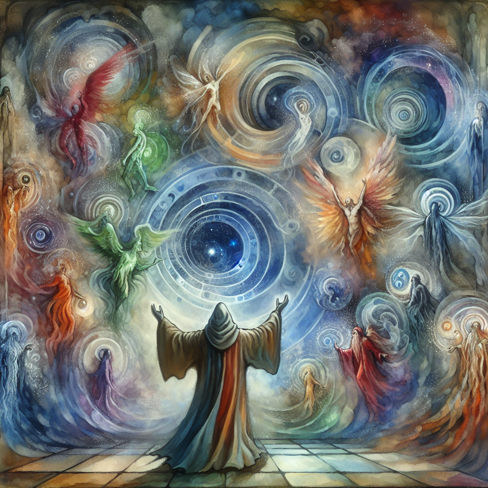

# Conjuration

Conjuration is one of the most complex and fascinating schools of magic within the arcane arts. It involves the summoning of entities, objects, and energies from other planes of existence to the caster's will. Practitioners of Conjuration, often referred to as [Conjurers](Conjurers.md) or [Summoners](Summoners.md), are revered and sometimes feared for their ability to call forth allies from the ether and bend the fabric of reality to manifest their desires.

## Overview

A Conjurer bridging the realms, summoning entities and objects from other planes.

The art of Conjuration is primarily focused on the interaction with other planes. These planes are vast and varied, each with its own set of rules and inhabitants. The skill of a Conjurer lies in their knowledge of these planes and their ability to navigate and negotiate with the entities that reside within them.

### Subschools of Conjuration

Conjuration can be divided into several subschools, each with its own specialized focus:

- **[Calling](Calling.md)**: The summoning of creatures to the caster's side, often to aid in battle or complete tasks.
- **[Creation](Creation.md)**: The conjuring of objects or substances out of thin air, which may last only momentarily or for a significant duration.
- **[Healing](Healing.md)**: A rare form of Conjuration that involves calling upon positive energy from other planes to mend wounds and cure ailments.
- **[Summoning](Summoning.md)**: Similar to Calling, but typically refers to the temporary bringing forth of entities that are more tightly bound to the caster's will.
- **[Teleportation](Teleportation.md)**: The instantaneous transportation of the caster, and sometimes others, across vast distances or even between different planes.

## Notable Conjurers

Throughout history, there have been many notable figures who have mastered the art of Conjuration. One such individual is [Grimbeorn the Builder](Grimbeorn%20the%20Builder.md), whose work with materials from various planes has significantly impacted the field. His techniques are studied by the [Mages of the Crystal Tower](Mages%20of%20the%20Crystal%20Tower.md), who seek to incorporate his architectural alchemy into their own magical constructs.

## Applications of Conjuration

The applications of Conjuration are as varied as the planes themselves. Here are some of the most common uses:

- **Military**: Summoning creatures to serve as allies in battle, such as during the [Battle of Broken Spears](Battle%20of%20Broken%20Spears.md).
- **Construction**: Calling forth materials and laborers from other planes to aid in building, a practice pioneered by Grimbeorn.
- **Communication**: Creating zones of undetectable conversation by summoning sound-absorbing qualities from plants like the [Silent Orchids](Silent%20Orchids.md).
- **Exploration**: Using teleportation to reach uncharted territories, such as the mysterious [Echovale Isle](Echovale%20Isle.md) or the [Enchanted Grove](Enchanted%20Grove.md).
- **Research**: Conjurers often work alongside [Divination](Divination.md) experts to uncover hidden knowledge and artifacts, such as those sought by the [Keepers of the Eldara Codex](Keepers%20of%20the%20Eldara%20Codex.md).

## The Ethical Debate

The practice of Conjuration is not without its controversies. The ethical implications of summoning sentient beings and the potential for abuse of conjured entities are hotly debated topics among the [Council of Arcana](Council%20of%20Arcana.md) and the [Wizards](Wizards.md) of various realms. There are strict codes of conduct that govern the use of Conjuration, and those who violate these codes may find themselves facing the justice of the [Councils of the Free Cities](Councils%20of%20the%20Free%20Cities.md).

## Learning Conjuration

Aspiring Conjurers must undergo rigorous training to master this school of magic. This often involves studying under a seasoned Summoner or enrolling in an institution like the [Mages of the Crystal Tower](Mages%20of%20the%20Crystal%20Tower.md). Students must learn not only the incantations and [reagents](Reagents.md) necessary for Conjuration but also the languages and customs of the planes they wish to interact with.

## Conclusion

Conjuration remains a vital and vibrant field of magical study, offering endless possibilities for those who dare to reach beyond the veil of reality. Whether it is to call forth allies from the [Plains of Valor](Plains%20of%20Valor.md) or to create marvels with materials from the [Dwarven Mines](Dwarven%20Mines.md), Conjuration continues to shape the world in both seen and unseen ways.