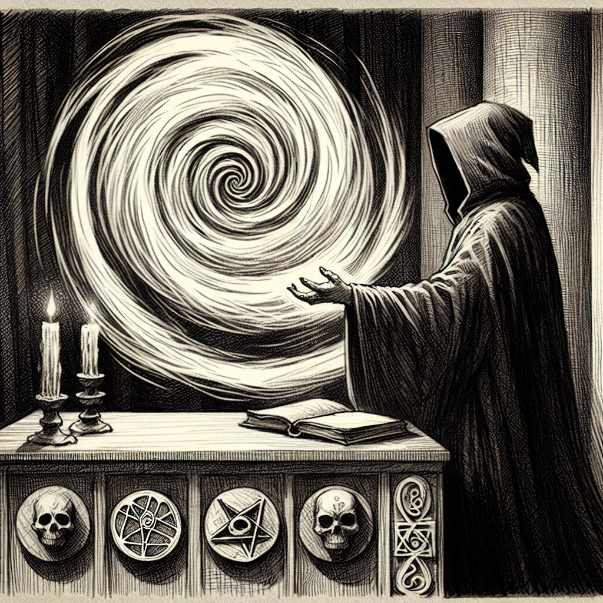

# Necromancy

Necromancy, often regarded with a mix of fear and fascination, is a complex and ancient arcane practice that delves into the manipulation of life force and the animation of the dead. This school of magic is shrouded in controversy, as it challenges the moral and ethical boundaries of life and death.

## Overview

A necromancer harnessing the energies of life and death during a ritual.

At its core, [Necromancy](Necromancy.md) is the study and application of magic that affects the essence of life and death. Practitioners of necromancy, known as [Necromancers](Necromancers.md), harness their knowledge to perform a variety of spells and rituals that can range from communicating with the spirits of the deceased to reanimating lifeless bodies to serve their will.

## History

The origins of necromancy are as old as the practice of magic itself, with early references found in the ancient texts of the [Lunar Ancients](Lunar%20Ancients.md). These texts describe necromancy as a sacred art, used to commune with ancestors and seek guidance from beyond the veil. Over time, the practice evolved, and some necromancers began to exploit these powers for personal gain, leading to the dark reputation that necromancy holds today.

## Techniques

### Communication with the Dead

One of the less controversial aspects of necromancy is the ability to speak with the spirits of the departed. This practice is often used by those seeking closure or wisdom from loved ones who have passed on. However, even this benign use is not without its risks, as the line between the living and the dead is not meant to be crossed lightly.

### Animation and Control

The most infamous aspect of necromancy is the animation of corpses, creating beings known as [Undead](Undead.md). These creatures are often bound to the necromancer's will, used as laborers, guardians, or soldiers. The ethical implications of this practice are heavily debated, particularly in the realms of [Military Strategy](Military%20Strategy.md), where undead forces can be a game-changing asset or a horrifying weapon.

### Life Force Manipulation

Some necromancers delve into the manipulation of life force itself, seeking to extend their own lives or to create life from death. This pursuit of immortality or creation is fraught with peril, as it can lead to corruption of the soul and the creation of abominations.

## Societal Impact

Necromancy's influence on society is profound. It is often associated with the darker aspects of magic and is typically practiced in secret due to its taboo nature. In some cultures, necromancers are outright persecuted, while in others, they may occupy a necessary, if uneasy, role within society.

## Notable Necromancers

Throughout history, there have been many notable necromancers whose actions have left an indelible mark on the world. Some, like the infamous [Seraphine](Seraphine.md), have become synonymous with the perils of delving too deeply into the necromantic arts.

## Necromancy and Other Magical Practices

Necromancy intersects with other schools of magic, such as [Conjuration](Conjuration.md) and [Enchantment](Enchantment.md), as well as the creation of magical [Artifacts](Artifacts.md). The [Academy of Planar Studies](Academy%20of%20Planar%20Studies.md) has been known to research the boundaries between necromancy and other arcane practices, seeking to understand and regulate the flow of life force across planes.

## Places of Power

Certain locations, such as the [Well of Stars](Well%20of%20Stars.md) and the [Sanctum of Whispers](Sanctum%20of%20Whispers.md), are rumored to be nexus points for necromantic energy. These places are often sought after by necromancers for their potent magical properties and are the sites of powerful rituals.

## Conclusion

Necromancy remains one of the most enigmatic and potent schools of magic within the arcane arts. Its practice is a testament to the unending quest for knowledge and power, standing as a reminder of the delicate balance between life and death. Whether reviled or revered, necromancy will continue to fascinate and horrify for as long as the veil between worlds remains a mystery to be explored.