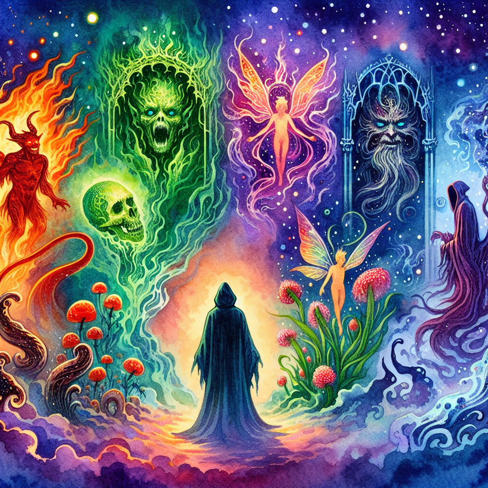

# Warlocks

Warlocks are spellcasters who gain their powers through pacts with otherworldly beings. Unlike [wizards](Wizards.md) who study ancient tomes, or [sorcerers](Sorcerers.md) who inherit their magic, warlocks are granted their abilities by entities from the [Shadowfell](Shadowfell.md), the [Infernal Planes](Infernal%20Planes.md), or other mysterious realms beyond the ken of ordinary mortals. These beings, known as patrons, are as varied as the powers they bestow, ranging from fiends and fey to eldritch creatures and deities of the [Aether](Aether.md).

"A warlock at the crossroads of destiny, flanked by the diverse patrons of their dark pacts.

## Pact Magic

The core of a warlock's power lies in their pact, a binding agreement between the warlock and their patron. This pact is often sealed with [rituals](Rituals.md) and oaths, and in exchange for service or loyalty, the patron grants the warlock access to unique spells and abilities. The nature of these spells can vary greatly depending on the patron, but they often include enchantments, curses, and the ability to manipulate the fabric of reality itself.

## Patrons

The patrons of warlocks are as diverse as the realms they inhabit. Some of the known types of patrons include:

- **The Fiends**: These patrons hail from the [Infernal Planes](Infernal%20Planes.md), offering their warlocks powers of fire and destruction. Warlocks bound to fiends may find themselves entangled in infernal politics or tasked with spreading chaos in the mortal realm.
- **The Archfey**: Patrons from the enchanted realms, such as the [Enchanted Grove](Enchanted%20Grove.md) or the domain of the [Fey](Fey.md), grant their warlocks abilities that twist the mind and ensnare the senses.
- **The Great Old Ones**: Enigmatic entities from the spaces between the stars, such as those whispered of by the [Lunar Ancients](Lunar%20Ancients.md), bestow eldritch knowledge and the power to warp reality.
- **The Shadowfell Entities**: Patrons from the Shadowfell, like those revered by the [Shadar-Kai](Shadar-Kai.md), offer their warlocks control over shadows and the energies of death and despair.

## Warlock Abilities

Warlocks are known for their eldritch invocations, a form of magic that allows them to perform feats beyond the scope of their spells. These invocations can grant them supernatural vision, the power to read any language, or even the ability to become invisible at will. Additionally, warlocks can channel their patron's power through an [arcane focus](Arcane Foci.md), such as a wand or rod, to cast spells with greater potency.

## Role in Society

Warlocks often occupy a precarious position in society. Their powers can make them invaluable allies, as seen with the [Ashen Brotherhood](Ashen%20Brotherhood.md)'s dominion over the Charred Forest. However, the source of their magic can also lead to suspicion and fear. In the [Free Cities](Free%20Cities.md), warlocks may serve as advisors or enforcers, while in more superstitious lands, they might be shunned or persecuted.

## Warlocks and Adventuring

Many warlocks are drawn to the life of an [adventurer](Adventurers.md), seeking to fulfill the terms of their pacts, gain further favor from their patrons, or escape the mistrust of society. On their quests, they might seek out [artifacts](Artifacts.md) imbued with the essence of their patron's realm, or they may be driven by prophecies and visions sent by their otherworldly benefactors.

## Known Warlock Orders

- **The Ashen Brotherhood**: A cabal of warlocks who have embraced the power of the Charred Forest within the Infernal Planes.
- **The Order of the Starry Gaze**: A secretive group of warlocks who serve the Great Old Ones and seek the hidden truths of the [Well of Stars](Well%20of%20Stars.md).
- **The Covenant of the Thorn**: Warlocks allied with the Archfey, often found meddling in the affairs of the [Free Cities](Free%20Cities.md) and beyond.

## Conclusion

Warlocks are a complex and often misunderstood class of spellcasters, walking a fine line between control and servitude. Their patrons grant them extraordinary powers, but often at a price. Whether they are feared or revered, warlocks will always be a source of fascination and unease among those who dwell in the realms of [magic](Magic.md) and the mundane alike.